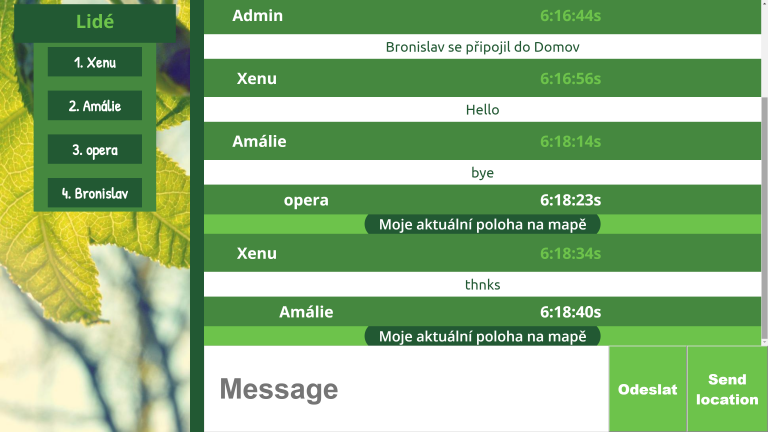

  

  <h3 align="center">ghost-chat</h3>

  

    Node.js chat app with sockets.io  
     

## Table of Contents

- [About the Project](#about-the-project)
  - [Built With](#built-with)
  - [Installation](#installation)
- [License](#license)
- [Contact](#contact)

## About The Project

 
   

   
  

Pick your username and room. Login.
   
Send messages and your location in google maps.
   
Delete everything by refreshing the page.
  

   

### Built With

- [Node](https://nodejs.org)
- [Socket.io](https://socket.io)
- [Express](https://expressjs.com)

### Installation

1. Create a folder to hold your installation: mkdir ghost-chat
2. FTP/Copy the contents of the zip to your newly created folder

3. Install dependencies: npm install

4. Start application: npm start

5. Visit http://localhost:3000 in your browser

## License

Distributed under the MIT License.

## Contact

andrewtomanek - andrewtomanek@gmail.com

Project Link: [https://github.com/andrewtomanek/ghost-chat](https://github.com/andrewtomanek/ghost-chat)
